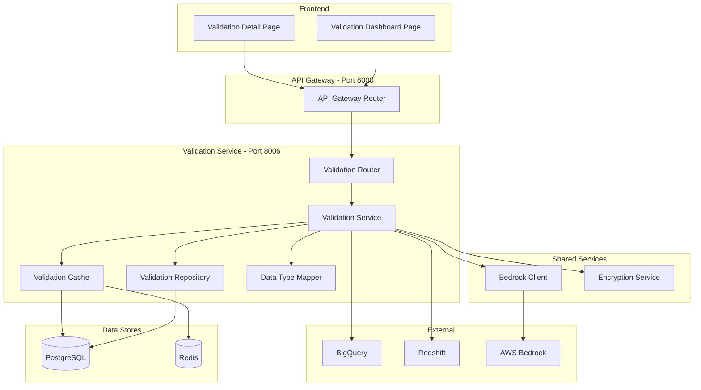

# Design Document: Data Validation Module

## Overview

The Data Validation Module provides post-migration data integrity verification for BigQuery-to-Redshift migrations within the DataMIQ platform. It performs three levels of validation per table: DDL schema comparison, row count verification, and record-level data matching. When discrepancies are found, the module invokes AWS Bedrock for AI-powered root cause analysis and workaround suggestions. Results are persisted, cached, and surfaced through a React dashboard.

The module follows the existing microservices architecture, running on port 8006 as the Validation Service. It integrates with existing Connection, Assessment, and Migration models, and follows established patterns for repository/service/router layering, Redis cache-aside, KMS credential decryption, workspace isolation, and structured logging.

### Key Design Decisions

1. **Sequential table processing**: Tables are validated one at a time within a background task to limit memory usage and simplify error isolation. Parallel table validation is a future optimization.
2. **Batched record-level matching**: Source and target data are read in configurable batches (default 10,000 rows) to avoid loading entire tables into memory.
3. **Assessment data as source-of-truth for source DDL**: Source column metadata comes from existing AssessmentColumn records rather than live BigQuery queries, reducing external calls and ensuring consistency with the assessment phase.
4. **Configurable type mappings**: Default BigQuery-to-Redshift type mappings are stored as a module-level constant dict, overridable per Validation_Run via JSONB.
5. **Graceful degradation**: Bedrock analysis failures, Redis unavailability, and individual table errors do not fail the entire run.

## Architecture



### Request Flow

1. Frontend calls `POST /api/validations` through API Gateway
2. Validation Router validates request, extracts workspace context
3. Validation Service creates Validation_Run and Validation_Table_Result records
4. Background task starts: for each table, runs DDL comparison → row count check → record-level match
5. On failures, Bedrock analysis is invoked per failed table
6. Progress and results are persisted to PostgreSQL and cached in Redis
7. Frontend polls `GET /api/validations/{run_id}` for progress updates

## Components and Interfaces

### 1. Validation Router (`backend/routers/validation_router.py`)

FastAPI router handling HTTP endpoints on port 8006. Follows the pattern in `conversion_router.py`.

```python
# Key endpoints
POST   /api/validations                          # Create and start validation run
GET    /api/validations                          # List runs (paginated, filtered)
GET    /api/validations/{run_id}                 # Get run details
GET    /api/validations/{run_id}/tables          # List table results
GET    /api/validations/{run_id}/tables/{name}   # Get table detail
GET    /api/validations/{run_id}/report          # Get full report
DELETE /api/validations/{run_id}                 # Delete run + cascade
```

**Dependencies injected**: `Session` (DB), `BackgroundTasks` (FastAPI), workspace_id from header.

### 2. Validation Service (`backend/services/validation_service.py`)

Core orchestration logic. Manages run lifecycle, delegates to sub-components.

```python
class ValidationService:
    def __init__(self, db: Session, cache: ValidationCache):
        self.db = db
        self.repo = ValidationRepository(db)
        self.cache = cache
        self.type_mapper = DataTypeMapper()
        self.bedrock = BedrockClient()

    def create_validation_run(self, workspace_id, migration_id, source_connection_id,
                               target_connection_id, tables, bedrock_model,
                               batch_size, type_mapping_overrides, created_by) -> dict

    def run_validation_background(self, run_id: int, workspace_id: int) -> None

    def _validate_ddl(self, run_id, table_name, dataset_name, assessment_id,
                       target_conn_params, type_mapping_overrides, workspace_id) -> dict

    def _validate_row_count(self, run_id, table_name, source_conn_params,
                             target_conn_params, workspace_id) -> dict

    def _validate_records(self, run_id, table_name, source_conn_params,
                           target_conn_params, primary_key, batch_size,
                           type_mapping_overrides, workspace_id) -> dict

    def _run_bedrock_analysis(self, table_name, ddl_result, row_count_result,
                               data_match_result, bedrock_model, workspace_id) -> dict

    def get_run(self, run_id: int, workspace_id: int) -> Optional[dict]
    def list_runs(self, workspace_id, migration_id, status, page, page_size) -> dict
    def get_table_results(self, run_id: int, workspace_id: int) -> list
    def get_table_detail(self, run_id: int, table_name: str, workspace_id: int) -> Optional[dict]
    def get_report(self, run_id: int, workspace_id: int) -> Optional[dict]
    def delete_run(self, run_id: int, workspace_id: int) -> bool
```

### 3. Validation Repository (`backend/repositories/validation_repository.py`)

Database access layer. All queries include `workspace_id` filter.

```python
class ValidationRepository:
    def __init__(self, db: Session):
        self.db = db

    def create_run(self, **kwargs) -> ValidationRun
    def get_run(self, run_id: int, workspace_id: int) -> Optional[ValidationRun]
    def list_runs(self, workspace_id, migration_id, status, page, page_size) -> tuple[list, int]
    def update_run(self, run_id: int, workspace_id: int, **kwargs) -> Optional[ValidationRun]
    def delete_run(self, run_id: int, workspace_id: int) -> bool

    def create_table_result(self, **kwargs) -> ValidationTableResult
    def get_table_result(self, run_id: int, table_name: str, workspace_id: int) -> Optional[ValidationTableResult]
    def list_table_results(self, run_id: int, workspace_id: int) -> list[ValidationTableResult]
    def update_table_result(self, result_id: int, workspace_id: int, **kwargs) -> Optional[ValidationTableResult]
```

### 4. Validation Cache (`backend/services/validation_cache.py`)

Redis cache-aside with PostgreSQL fallback. Follows `ConversionCache` pattern.

```python
class ValidationCache:
    RUN_TTL = 900          # 15 minutes
    TABLE_RESULT_TTL = 900 # 15 minutes
    REPORT_TTL = 1800      # 30 minutes

    def get_run(self, run_id: int, workspace_id: int) -> Optional[dict]
    def set_run(self, run_id: int, workspace_id: int, data: dict) -> None
    def invalidate_run(self, run_id: int, workspace_id: int) -> None

    def get_table_result(self, run_id: int, table_name: str, workspace_id: int) -> Optional[dict]
    def set_table_result(self, run_id: int, table_name: str, workspace_id: int, data: dict) -> None
    def invalidate_table_result(self, run_id: int, table_name: str, workspace_id: int) -> None

    def get_report(self, run_id: int, workspace_id: int) -> Optional[dict]
    def set_report(self, run_id: int, workspace_id: int, data: dict) -> None
    def invalidate_report(self, run_id: int, workspace_id: int) -> None

    def invalidate_all_for_run(self, run_id: int, workspace_id: int) -> None
```

Cache key patterns include workspace_id:
- `validation:run:{workspace_id}:{run_id}`
- `validation:table:{workspace_id}:{run_id}:{table_name}`
- `validation:report:{workspace_id}:{run_id}`

### 5. Data Type Mapper (`backend/services/data_type_mapper.py`)

Encapsulates BigQuery-to-Redshift type equivalence logic.

```python
# Default mapping constant
DEFAULT_BQ_TO_REDSHIFT_TYPE_MAP: dict[str, str] = {
    "STRING": "VARCHAR",
    "INT64": "BIGINT",
    "FLOAT64": "DOUBLE PRECISION",
    "NUMERIC": "DECIMAL",
    "BIGNUMERIC": "DECIMAL",
    "BOOL": "BOOLEAN",
    "TIMESTAMP": "TIMESTAMP",
    "DATE": "DATE",
    "TIME": "TIME",
    "BYTES": "VARBYTE",
    "ARRAY": "SUPER",
    "STRUCT": "SUPER",
}

class DataTypeMapper:
    def __init__(self, overrides: Optional[dict] = None):
        self.mapping = {**DEFAULT_BQ_TO_REDSHIFT_TYPE_MAP, **(overrides or {})}

    def is_equivalent(self, bq_type: str, redshift_type: str) -> bool
    def get_expected_redshift_type(self, bq_type: str) -> Optional[str]
    def to_dict(self) -> dict
    
    @classmethod
    def from_dict(cls, data: dict) -> "DataTypeMapper"
```

### 6. Frontend Components

**Validation Dashboard Page** (`frontend/src/pages/ValidationDashboardPage.tsx`):
- Lists validation runs in a table with status, progress, pass/fail counts
- "New Validation" button opens creation form
- Filters by status and migration
- Auto-refresh while runs are active
- Follows `BatchConverterPage.tsx` wizard/list pattern

**Validation Detail Page** (`frontend/src/pages/ValidationDetailPage.tsx`):
- Shows run summary with progress bar
- Table of per-table results with expandable detail panels
- DDL side-by-side comparison, row count stats, record match summary
- AI Analysis section for failed tables
- Download Report button

**Validation API Service** (`frontend/src/services/validationApi.ts`):
- Typed API client following `conversionApi.ts` pattern


## Data Models

### SQLAlchemy Models

#### ValidationRun (`backend/models/validation_run.py`)

```python
class ValidationRun(Base):
    __tablename__ = 'validation_runs'

    id = Column(Integer, primary_key=True, autoincrement=True)
    workspace_id = Column(Integer, nullable=False)
    migration_id = Column(Integer, nullable=False)
    source_connection_id = Column(Integer, nullable=False)
    target_connection_id = Column(Integer, nullable=False)
    bedrock_model = Column(String(255), nullable=True)
    batch_size = Column(Integer, nullable=False, default=10000)
    type_mapping_overrides = Column(JSONB, nullable=True)
    status = Column(String(50), nullable=False, default='pending')
    progress_percentage = Column(Integer, nullable=False, default=0)
    tables_total = Column(Integer, nullable=False, default=0)
    tables_passed = Column(Integer, nullable=False, default=0)
    tables_failed = Column(Integer, nullable=False, default=0)
    tables_error = Column(Integer, nullable=False, default=0)
    started_at = Column(DateTime, nullable=True)
    completed_at = Column(DateTime, nullable=True)
    duration_seconds = Column(Integer, nullable=True)
    created_by = Column(String(255), nullable=False)
    created_at = Column(DateTime, nullable=False, server_default=func.current_timestamp())
    updated_at = Column(DateTime, nullable=False, server_default=func.current_timestamp(),
                        onupdate=func.current_timestamp())

    __table_args__ = (
        Index('idx_validation_runs_workspace', 'workspace_id'),
        Index('idx_validation_runs_migration', 'migration_id'),
        Index('idx_validation_runs_status', 'status'),
    )
```

#### ValidationTableResult (`backend/models/validation_table_result.py`)

```python
class ValidationTableResult(Base):
    __tablename__ = 'validation_table_results'

    id = Column(Integer, primary_key=True, autoincrement=True)
    run_id = Column(Integer, ForeignKey('validation_runs.id', ondelete='CASCADE'), nullable=False)
    workspace_id = Column(Integer, nullable=False)
    table_name = Column(String(255), nullable=False)
    dataset_name = Column(String(255), nullable=True)
    ddl_status = Column(String(50), nullable=True)          # passed, failed, error
    ddl_comparison_result = Column(JSONB, nullable=True)
    row_count_status = Column(String(50), nullable=True)     # passed, failed, error
    row_count_result = Column(JSONB, nullable=True)
    data_match_status = Column(String(50), nullable=True)    # passed, failed, error
    data_match_result = Column(JSONB, nullable=True)
    ai_analysis = Column(JSONB, nullable=True)
    status = Column(String(50), nullable=False, default='pending')  # pending, running, completed, failed, error
    error_message = Column(Text, nullable=True)
    started_at = Column(DateTime, nullable=True)
    completed_at = Column(DateTime, nullable=True)
    duration_seconds = Column(Integer, nullable=True)
    created_at = Column(DateTime, nullable=False, server_default=func.current_timestamp())
    updated_at = Column(DateTime, nullable=False, server_default=func.current_timestamp(),
                        onupdate=func.current_timestamp())

    __table_args__ = (
        Index('idx_vtresults_run', 'run_id'),
        Index('idx_vtresults_workspace', 'workspace_id'),
        Index('idx_vtresults_table_name', 'table_name'),
        Index('idx_vtresults_status', 'status'),
    )
```

### Pydantic Schemas (`backend/models/validation_schemas.py`)

```python
class ValidationRunStatus(str, Enum):
    PENDING = "pending"
    RUNNING = "running"
    COMPLETED = "completed"
    FAILED = "failed"

class ValidationStepStatus(str, Enum):
    PASSED = "passed"
    FAILED = "failed"
    ERROR = "error"

class CreateValidationRunRequest(BaseModel):
    migration_id: int
    source_connection_id: int
    target_connection_id: int
    tables: Optional[list[str]] = None
    bedrock_model: Optional[str] = None
    batch_size: int = Field(default=10000, ge=100, le=100000)
    type_mapping_overrides: Optional[dict[str, str]] = None

class ValidationRunResponse(BaseModel):
    id: int
    workspace_id: int
    migration_id: int
    source_connection_id: int
    target_connection_id: int
    status: str
    progress_percentage: int
    tables_total: int
    tables_passed: int
    tables_failed: int
    tables_error: int
    started_at: Optional[datetime] = None
    completed_at: Optional[datetime] = None
    duration_seconds: Optional[int] = None
    created_by: str
    created_at: datetime
    updated_at: datetime

class ValidationTableResultResponse(BaseModel):
    id: int
    run_id: int
    table_name: str
    dataset_name: Optional[str] = None
    ddl_status: Optional[str] = None
    row_count_status: Optional[str] = None
    data_match_status: Optional[str] = None
    status: str
    error_message: Optional[str] = None
    started_at: Optional[datetime] = None
    completed_at: Optional[datetime] = None
    duration_seconds: Optional[int] = None

class ValidationTableDetailResponse(ValidationTableResultResponse):
    ddl_comparison_result: Optional[dict] = None
    row_count_result: Optional[dict] = None
    data_match_result: Optional[dict] = None
    ai_analysis: Optional[dict] = None

class ValidationReportResponse(BaseModel):
    run_id: int
    migration_id: int
    source_connection_name: str
    target_connection_name: str
    overall_status: str
    total_tables: int
    tables_passed: int
    tables_failed: int
    tables_error: int
    started_at: Optional[datetime] = None
    completed_at: Optional[datetime] = None
    duration_seconds: Optional[int] = None
    tables: list[ValidationTableDetailResponse]

class PaginatedValidationRunsResponse(BaseModel):
    runs: list[ValidationRunResponse]
    total: int
    page: int
    page_size: int
```

### JSONB Field Structures

**ddl_comparison_result**:
```json
{
  "discrepancies": [
    {
      "type": "missing_column | extra_column | type_mismatch | nullability_mismatch",
      "column_name": "user_id",
      "source_type": "INT64",
      "target_type": null,
      "expected_type": "BIGINT"
    }
  ],
  "source_column_count": 12,
  "target_column_count": 11,
  "columns_compared": 12
}
```

**row_count_result**:
```json
{
  "source_count": 1500000,
  "target_count": 1499998,
  "difference": 2,
  "percentage_difference": 0.00013
}
```

**data_match_result**:
```json
{
  "total_compared": 1500000,
  "matched_count": 1499995,
  "missing_count": 2,
  "extra_count": 0,
  "mismatch_count": 3,
  "sample_discrepancies": [
    {
      "type": "missing_in_target",
      "primary_key": {"id": 42},
      "details": null
    },
    {
      "type": "value_mismatch",
      "primary_key": {"id": 99},
      "details": {"column": "amount", "source_value": "100.50", "target_value": "100.5"}
    }
  ]
}
```

**ai_analysis**:
```json
{
  "root_cause": "Timestamp precision loss during AVRO export...",
  "impact_assessment": "Affects 3 records with sub-millisecond timestamps...",
  "recommended_workarounds": [
    "Truncate source timestamps to microsecond precision before migration",
    "Apply post-migration UPDATE to fix affected records"
  ]
}
```

### Alembic Migration

A single Alembic migration script creates both tables with indexes, constraints, and CASCADE delete. Downgrade drops both tables.

```python
# alembic/versions/xxxx_create_validation_tables.py
def upgrade():
    op.create_table('validation_runs', ...)
    op.create_table('validation_table_results', ...)
    # Indexes created via table_args

def downgrade():
    op.drop_table('validation_table_results')
    op.drop_table('validation_runs')
```
